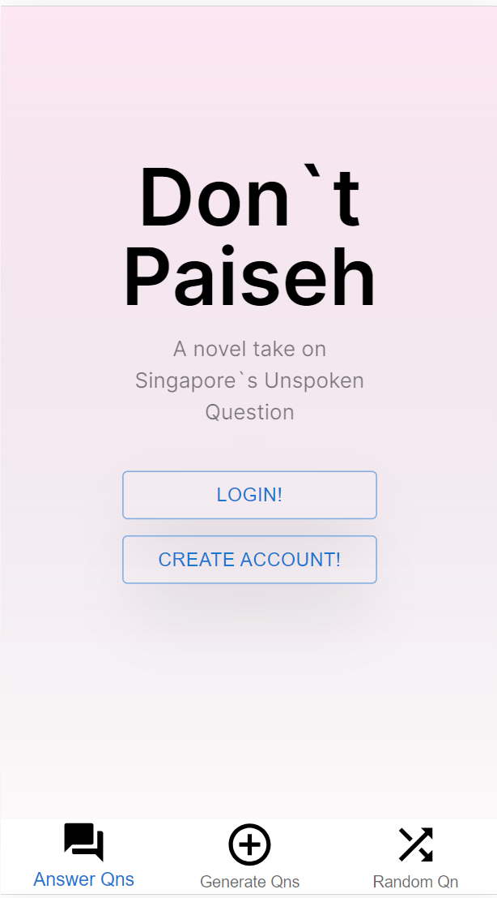
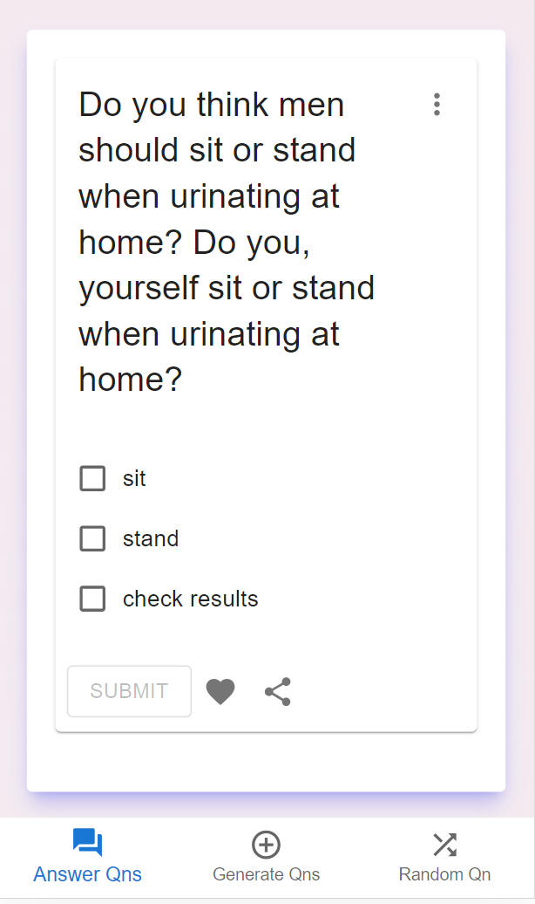
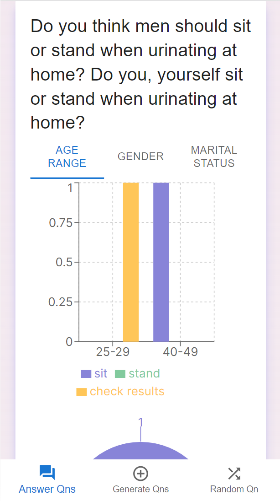

# HackAndRoll 2024
# Don't Paiseh (Frontend)

**Note:** This repository contains only the frontend code for the "Don't Paiseh" app. The backend code is located in a separate repository, which can be found [here]([link-to-backend-repo](https://github.com/moroha29/HackAndRollBE)).

## Overview

"Don't Paiseh" is a unique app that presents users with a series of simple selection quizzes covering a wide range of socially unique and intriguing questions. These questions touch on various topics, including relationship practices, habits, certain preferences, and hypothetical situations. Users can choose from multiple-choice options to respond to each question.

Upon selecting their responses, users gain insights into the collective responses of all other users who participated in the same question. The data is visually represented through pie charts and bar charts. Users have the flexibility to filter the results based on demographic information, such as age group, marital status, and gender.

## Features

- Engaging selection quizzes on socially unique questions.
- Real-time visibility into the aggregated responses of all users for each question.
- Visual representation of data through pie charts and bar charts.
- Demographic filters for exploring responses based on age group, marital status, and gender.
- **User-Generated Questions:** Users can contribute to the question pool by submitting their own questions based on their curiosity.
- **GPT API Integration:** Utilize our button to recommend questions using the GPT API, allowing users to generate and edit questions seamlessly.

## Getting Started

To set up the frontend locally, follow these steps:

1. Clone this repository.
2. Install dependencies using `npm install`.
3. Run the app using `npm run dev`.

**Note:** For the backend code, please refer to the ([backend repository](https://github.com/moroha29/HackAndRollBE)) for installation and setup instructions.

## Screenshots
When users are loaded into the mobile application, they are brought to the home page.  

The authentication process will allow us to gain an understanding of their demographics, which will be used to display the results of each question.

 
After authentication, users will be provided with questions where they can respond to. They will then be presented with the responses in the form of charts from other users.

